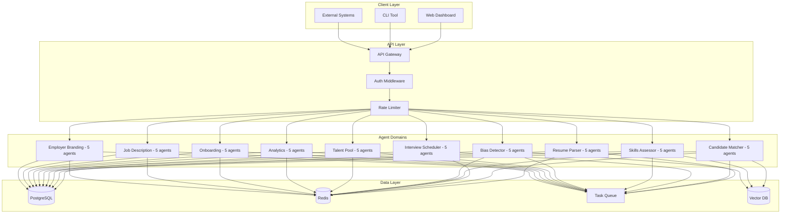

<div align="center">

# Recruitment Platform

[](https://github.com/your-org/recruitment-platform/actions)
[](LICENSE)
[](https://python.org)
[](https://fastapi.tiangolo.com)
[](CONTRIBUTING.md)

> Unified AI-powered recruitment automation platform with 50 specialized agents across 10 domains.

[Quick Start](#quick-start) · [Features](#features) · [API](#api-reference) · [Deployment](#deployment) · [Contributing](#contributing)

</div>

---

## Table of Contents

- [Overview](#overview)
- [Quick Start](#quick-start)
- [Features](#features)
- [API Reference](#api-reference)
- [Deployment](#deployment)
- [Development](#development)
- [Contributing](#contributing)
- [License](#license)
- [Changelog](#changelog)

---

## Overview

Recruitment Platform is a consolidated, modular recruitment system that unifies 10 independent recruitment sub-projects into a single, production-grade FastAPI application. It provides 50 AI-powered agents across 10 recruitment domains, all accessible through a unified REST API.

### Architecture



---

## Quick Start

### Prerequisites

- Python 3.12+
- Docker & Docker Compose (optional)
- PostgreSQL 16+ (for production)

### Local Development

```bash
# Clone the repository
git clone <repository-url>
cd recruitment-platform

# Create virtual environment
python -m venv .venv
source .venv/bin/activate

# Install dependencies
pip install -e ".[dev]"

# Configure environment
cp .env.example .env
# Edit .env with your settings

# Run the application
python -m recruitment_platform.main
```

### Docker

```bash
# Build and run with Docker Compose
docker-compose up --build

# Access the application
# API: http://localhost:8000
# Docs: http://localhost:8000/docs
```

---

## Features

| Domain | Agents | Key Capabilities |
|--------|--------|------------------|
| **Resume Parser** | 5 | Contact extraction, education parsing, experience analysis, skills identification |
| **Candidate Matcher** | 5 | Semantic matching, culture fit, bias-aware ranking, skills gap analysis |
| **Interview Scheduler** | 5 | Availability optimization, calendar sync, conflict detection, timezone handling |
| **Skills Assessor** | 5 | Proficiency scoring, learning path recommendations, skill validation |
| **Bias Detector** | 5 | Language bias detection, fairness scoring, demographic analysis, mitigation |
| **Talent Pool** | 5 | Candidate sourcing, engagement tracking, pool health analysis, talent tagging |
| **Analytics** | 5 | Funnel analysis, diversity metrics, cost analysis, predictive hiring |
| **Onboarding** | 5 | Compliance checking, document generation, progress tracking, task scheduling |
| **Job Description** | 5 | ATS compatibility, bias removal, keyword optimization, SEO, tone analysis |
| **Employer Branding** | 5 | Brand strategy, content generation, reputation management, sentiment analysis |

---

## API Reference

### Base URL

```
http://localhost:8000/api/v1
```

### Authentication

All endpoints require a Bearer token:

```http
Authorization: Bearer <your-api-token>
```

### Core Endpoints

| Module | Prefix | Endpoints |
|--------|--------|-----------|
| Health | `/health` | 2 |
| Resume Parser | `/resume-parser` | 3 |
| Candidate Matcher | `/candidate-matcher` | 3 |
| Interview Scheduler | `/interview-scheduler` | 3 |
| Skills Assessor | `/skills-assessor` | 3 |
| Bias Detector | `/bias-detector` | 4 |
| Talent Pool | `/talent-pool` | 4 |
| Analytics | `/analytics` | 5 |
| Onboarding | `/onboarding` | 5 |
| Job Description | `/job-description` | 5 |
| Employer Branding | `/employer-branding` | 5 |

**Total: 42 API endpoints**

### Example: Parse a Resume

```bash
curl -X POST http://localhost:8000/api/v1/resume-parser/parse \
  -H "Authorization: Bearer $TOKEN" \
  -H "Content-Type: application/json" \
  -d '{"resume_text": "John Doe\nSoftware Engineer\n5 years experience..."}'
```

### Response Format

```json
{
  "data": { "name": "John Doe", "skills": ["Python", "FastAPI"] },
  "meta": { "request_id": "req_abc123", "timestamp": "2026-10-03T10:00:00Z" }
}
```

---

## Deployment

### Docker Compose (Production)

```bash
docker-compose -f docker-compose.prod.yml up -d
```

### Kubernetes

```bash
kubectl apply -f k8s/base/
kubectl apply -f k8s/overlays/production/
```

### Environment Variables

| Variable | Required | Description |
|----------|----------|-------------|
| `DATABASE_URL` | Yes | PostgreSQL connection string |
| `REDIS_URL` | Yes | Redis connection string |
| `SECRET_KEY` | Yes | JWT signing secret |
| `OPENAI_API_KEY` | No | AI agent features |
| `OPENAI_MODEL` | No | Model selection (default: gpt-4) |
| `LOG_LEVEL` | No | Logging level (default: INFO) |

---

## Development

### Project Structure

```
recruitment-platform/
├── src/recruitment_platform/
│   ├── agents/               # 50 AI agents across 10 domains
│   ├── api/                  # REST API endpoints
│   ├── config/               # Configuration management
│   ├── integrations/         # External service clients
│   ├── models/               # Pydantic schemas
│   ├── services/             # Business logic layer
│   └── tests/                # Test suite
├── k8s/                      # Kubernetes manifests
├── .github/workflows/        # CI/CD pipelines
├── docs/                     # Documentation
├── diagrams/                 # Architecture diagrams
├── monitoring/               # Monitoring configuration
├── Dockerfile
├── docker-compose.yml
└── pyproject.toml
```

### Common Commands

```bash
# Run all tests
pytest

# Run with coverage
pytest --cov=recruitment_platform --cov-report=html

# Linting and type checking
ruff check .
mypy src/

# Run specific test file
pytest src/recruitment_platform/tests/test_agents.py
```

---

## Contributing

We welcome contributions! Please follow these steps:

1. **Fork** the repository
2. **Create** a feature branch: `git checkout -b feature/amazing-feature`
3. **Commit** your changes: `git commit -m "feat: add amazing feature"`
4. **Push** to the branch: `git push origin feature/amazing-feature`
5. **Open** a Pull Request

### Guidelines

- Follow the [Conventional Commits](https://www.conventionalcommits.org/) specification
- Write tests for new features
- Update documentation for API changes
- Ensure `pytest` and `ruff check .` pass before submitting

See [CONTRIBUTING.md](CONTRIBUTING.md) for detailed guidelines.

---

## License

This project is licensed under the MIT License — see the [LICENSE](LICENSE) file for details.

---

## Changelog

### [1.2.0] - 2026-10-01

#### Added
- AI-powered candidate matching with skill gap analysis
- Multi-channel job distribution
- Real-time collaboration features

#### Changed
- Upgraded to Python 3.12
- Improved vector search performance by 40%

#### Fixed
- Interview timezone conversion bug
- Candidate duplicate detection edge case

### [1.1.0] - 2026-08-15

#### Added
- Kanban pipeline view
- Google Calendar integration
- Advanced analytics dashboard

#### Changed
- Refactored authentication to use JWT with refresh tokens

#### Fixed
- Resume parsing for PDF files with embedded fonts

### [1.0.0] - 2026-06-01

#### Added
- Initial release with core recruitment features
- 50 AI agents across 10 domains
- REST API with OpenAPI documentation

---

<div align="center">

Made with ❤️ by the Recruitment Platform Team

</div>
