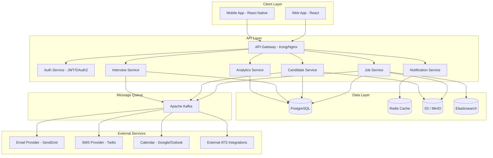

# Recruitment Platform

A modern, scalable recruitment platform for managing job postings, candidate applications, interview scheduling, and hiring workflows.

## Table of Contents

- [Architecture](#architecture)
- [Features](#features)
- [Quick Start](#quick-start)
- [Configuration](#configuration)
- [Development](#development)
- [Documentation](#documentation)
- [Contributing](#contributing)
- [License](#license)

---

## Architecture



### Service Responsibilities

| Service | Responsibility |
|---------|---------------|
| **API Gateway** | Rate limiting, request routing, SSL termination |
| **Auth Service** | Authentication, authorization, JWT token management |
| **Job Service** | Job CRUD, search, categorization, publishing |
| **Candidate Service** | Candidate profiles, resume parsing, application tracking |
| **Interview Service** | Scheduling, calendar sync, feedback collection |
| **Notification Service** | Email, SMS, push notifications |
| **Analytics Service** | Dashboards, reporting, metrics aggregation |

---

## Features

### Core Features

- **Job Management** — Create, edit, publish, and archive job postings with rich text descriptions
- **Candidate Management** — Full candidate lifecycle from application to hire
- **Resume Parsing** — AI-powered resume extraction and candidate matching
- **Interview Scheduling** — Automated scheduling with calendar integration
- **Pipeline Management** — Kanban-style hiring pipeline with customizable stages
- **Communication** — Built-in email and SMS communication with templates
- **Analytics & Reporting** — Real-time dashboards and exportable reports
- **Multi-tenancy** — Support for multiple organizations with isolated data
- **Role-Based Access Control** — Granular permissions for recruiters, hiring managers, and admins
- **API-First Design** — RESTful API with OpenAPI 3.0 specification

### Integrations

- Google Calendar / Outlook Calendar
- SendGrid / Mailgun for email
- Twilio for SMS
- LinkedIn, Indeed, Greenhouse, Lever (ATS integrations)
- Slack notifications
- Webhook support for custom integrations

---

## Quick Start

### Prerequisites

- Node.js 18+ and npm 9+
- Docker 24+ and Docker Compose 2+
- PostgreSQL 15+
- Redis 7+

### Installation

```bash
# Clone the repository
git clone https://github.com/your-org/recruitment-platform.git
cd recruitment-platform

# Install dependencies
npm install

# Copy environment configuration
cp .env.example .env

# Start infrastructure services
docker-compose -f docker-compose.infra.yml up -d

# Run database migrations
npm run migrate

# Seed development data
npm run seed

# Start development server
npm run dev
```

The application will be available at `http://localhost:3000`.

### Docker Quick Start

```bash
# Start all services with Docker Compose
docker-compose up -d

# View logs
docker-compose logs -f app

# Stop all services
docker-compose down
```

### Verify Installation

```bash
# Health check
curl http://localhost:3000/health

# Expected response
# {"status":"ok","version":"1.0.0","timestamp":"2024-01-15T10:30:00Z"}
```

---

## Configuration

### Environment Variables

| Variable | Description | Default |
|----------|-------------|---------|
| `NODE_ENV` | Environment mode | `development` |
| `PORT` | Server port | `3000` |
| `DATABASE_URL` | PostgreSQL connection string | — |
| `REDIS_URL` | Redis connection string | — |
| `JWT_SECRET` | JWT signing secret | — |
| `JWT_EXPIRATION` | JWT token expiration | `24h` |
| `S3_BUCKET` | S3 bucket for file storage | — |
| `S3_REGION` | S3 region | `us-east-1` |
| `ELASTICSEARCH_URL` | Elasticsearch connection | — |
| `KAFKA_BROKERS` | Kafka broker list | — |
| `SENDGRID_API_KEY` | SendGrid API key | — |
| `TWILIO_ACCOUNT_SID` | Twilio account SID | — |
| `TWILIO_AUTH_TOKEN` | Twilio auth token | — |

### Feature Flags

```env
ENABLE_RESUME_PARSING=true
ENABLE_AI_MATCHING=true
ENABLE_ANALYTICS=true
ENABLE_WEBHOOKS=true
```

---

## Development

### Project Structure

```
recruitment-platform/
├── src/
│   ├── services/          # Microservices
│   │   ├── auth/
│   │   ├── jobs/
│   │   ├── candidates/
│   │   ├── interviews/
│   │   ├── notifications/
│   │   └── analytics/
│   ├── gateway/           # API Gateway
│   ├── shared/            # Shared libraries
│   └── types/             # TypeScript type definitions
├── tests/                 # Test suites
├── docs/                  # Documentation
├── docker/                # Docker configurations
├── k8s/                   # Kubernetes manifests
├── terraform/             # Infrastructure as Code
└── scripts/               # Utility scripts
```

### Running Tests

```bash
# Run all tests
npm test

# Run tests with coverage
npm run test:coverage

# Run specific service tests
npm run test -- --grep "Job Service"

# Run integration tests
npm run test:integration
```

### Code Quality

```bash
# Lint
npm run lint

# Format
npm run format

# Type check
npm run type-check
```

---

## Documentation

- [API Reference](./API.md) — Complete REST API documentation
- [Deployment Guide](./DEPLOYMENT.md) — Docker, Kubernetes, and Terraform deployment
- [Contributing Guide](./CONTRIBUTING.md) — How to contribute
- [Changelog](./CHANGELOG.md) — Version history

---

## Contributing

1. Fork the repository
2. Create a feature branch (`git checkout -b feature/amazing-feature`)
3. Commit your changes (`git commit -m 'Add amazing feature'`)
4. Push to the branch (`git push origin feature/amazing-feature`)
5. Open a Pull Request

Please read our [Contributing Guide](./CONTRIBUTING.md) for details on our code of conduct and development process.

---

## License

This project is licensed under the MIT License — see the [LICENSE](./LICENSE) file for details.
