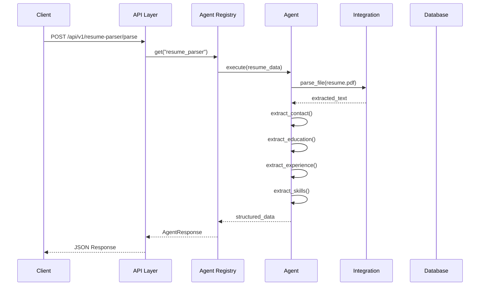
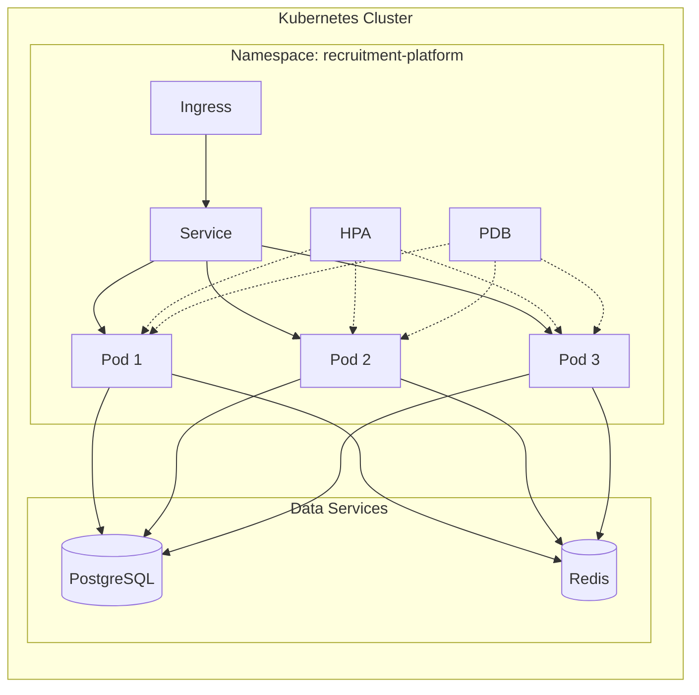
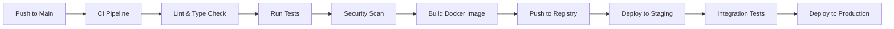
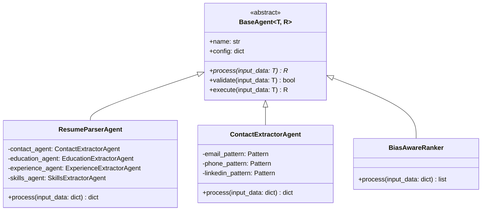

# Recruitment Platform Architecture

## System Overview

The Recruitment Platform is a modular, AI-powered recruitment automation system built with FastAPI. It consolidates 50 AI agents across 10 recruitment domains into a single, production-grade REST API.

## High-Level Architecture

```mermaid
graph TB
    subgraph "Client Layer"
        Web[Web Dashboard]
        Mobile[Mobile App]
        API[External API Clients]
    end

    subgraph "API Gateway"
        GW[NGINX Ingress]
    end

    subgraph "Recruitment Platform"
        subgraph "API Layer"
            Health[Health Endpoints]
            RP[Resume Parser API]
            CM[Candidate Matcher API]
            IS[Interview Scheduler API]
            SA[Skills Assessor API]
            BD[Bias Detector API]
            TPM[Talent Pool API]
            RA[Analytics API]
            OA[Onboarding API]
            JDO[Job Description API]
            EB[Employer Branding API]
        end

        subgraph "Agent Layer"
            direction TB
            subgraph "Resume Parser Agents"
                RPA1[ResumeParserAgent]
                RPA2[ContactExtractor]
                RPA3[EducationExtractor]
                RPA4[ExperienceExtractor]
                RPA5[SkillsExtractor]
            end
            subgraph "Candidate Matcher Agents"
                CMA1[BiasAwareRanker]
                CMA2[CultureFitAssessor]
                CMA3[MatchExplainer]
                CMA4[SemanticMatcher]
                CMA5[SkillsGapAnalyzer]
            end
            subgraph "Interview Scheduler Agents"
                ISA1[AvailabilityOptimizer]
                ISA2[CalendarSync]
                ISA3[ConflictDetector]
                ISA4[Reminder]
                ISA5[TimezoneResolver]
            end
            subgraph "Skills Assessor Agents"
                SAA1[GapAnalyzer]
                SAA2[LearningPathRecommender]
                SAA3[ProficiencyScorer]
                SAA4[SkillExtractor]
                SAA5[SkillValidator]
            end
            subgraph "Bias Detector Agents"
                BDA1[DemographicAnalyzer]
                BDA2[FairnessScorer]
                BDA3[LanguageBiasDetector]
                BDA4[PatternDetector]
                BDA5[Recommendation]
            end
            subgraph "Talent Pool Agents"
                TPMA1[CandidateSourcer]
                TPMA2[EngagementTracker]
                TPMA3[PoolAnalyzer]
                TPMA4[TalentRecommender]
                TPMA5[TalentTagger]
            end
            subgraph "Analytics Agents"
                RAA1[CostAnalyzer]
                RAA2[DiversityAnalyzer]
                RAA3[FunnelAnalyzer]
                RAA4[PredictiveHiring]
                RAA5[SourceTracker]
            end
            subgraph "Onboarding Agents"
                OAA1[ComplianceChecker]
                OAA2[DocumentGenerator]
                OAA3[ProgressTracker]
                OAA4[TaskScheduler]
                OAA5[WelcomeMessage]
            end
            subgraph "Job Description Agents"
                JDA1[ATSCompatibility]
                JDA2[BiasRemover]
                JDA3[KeywordOptimizer]
                JDA4[SEOOptimizer]
                JDA5[ToneAnalyzer]
            end
            subgraph "Employer Branding Agents"
                EBA1[BrandStrategy]
                EBA2[ContentGenerator]
                EBA3[ReputationManager]
                EBA4[ReviewAnalyzer]
                EBA5[SentimentAnalyzer]
            end
        end

        subgraph "Service Layer"
            AR[Agent Registry]
            PS[Parsing Service]
        end

        subgraph "Integration Layer"
            LLM[LLM Client]
            EMB[Embedding Client]
            VS[Vector Store]
            FP[File Parser]
            ST[Storage]
            CAL[Calendar]
            OAI[OpenAI]
            ATS[ATS Client]
            HRMS[HRMS Client]
            GD[Glassdoor]
            IND[Indeed]
            LI[LinkedIn]
            SDB[Skill Database]
        end

        subgraph "Config Layer"
            SET[Settings]
            LOG[Logging Config]
            EXC[Exceptions]
        end
    end

    subgraph "Data Layer"
        PG[(PostgreSQL)]
        RD[(Redis)]
        S3[(Object Storage)]
    end

    subgraph "External Services"
        OAI_EXT[OpenAI API]
        GC[Google Calendar]
        OL[Outlook]
    end

    Web --> GW
    Mobile --> GW
    API --> GW

    GW --> Health
    GW --> RP
    GW --> CM
    GW --> IS
    GW --> SA
    GW --> BD
    GW --> TPM
    GW --> RA
    GW --> OA
    GW --> JDO
    GW --> EB

    RP --> RPA1 & RPA2 & RPA3 & RPA4 & RPA5
    CM --> CMA1 & CMA2 & CMA3 & CMA4 & CMA5
    IS --> ISA1 & ISA2 & ISA3 & ISA4 & ISA5
    SA --> SAA1 & SAA2 & SAA3 & SAA4 & SAA5
    BD --> BDA1 & BDA2 & BDA3 & BDA4 & BDA5
    TPM --> TPMA1 & TPMA2 & TPMA3 & TPMA4 & TPMA5
    RA --> RAA1 & RAA2 & RAA3 & RAA4 & RAA5
    OA --> OAA1 & OAA2 & OAA3 & OAA4 & OAA5
    JDO --> JDA1 & JDA2 & JDA3 & JDA4 & JDA5
    EB --> EBA1 & EBA2 & EBA3 & EBA4 & EBA5

    RPA1 & RPA2 & RPA3 & RPA4 & RPA5 --> AR
    CMA1 & CMA2 & CMA3 & CMA4 & CMA5 --> AR
    ISA1 & ISA2 & ISA3 & ISA4 & ISA5 --> AR
    SAA1 & SAA2 & SAA3 & SAA4 & SAA5 --> AR
    BDA1 & BDA2 & BDA3 & BDA4 & BDA5 --> AR
    TPMA1 & TPMA2 & TPMA3 & TPMA4 & TPMA5 --> AR
    RAA1 & RAA2 & RAA3 & RAA4 & RAA5 --> AR
    OAA1 & OAA2 & OAA3 & OAA4 & OAA5 --> AR
    JDA1 & JDA2 & JDA3 & JDA4 & JDA5 --> AR
    EBA1 & EBA2 & EBA3 & EBA4 & EBA5 --> AR

    AR --> PS
    AR --> LLM
    AR --> EMB
    AR --> VS
    AR --> FP
    AR --> ST
    AR --> CAL
    AR --> OAI
    AR --> ATS
    AR --> HRMS
    AR --> GD
    AR --> IND
    AR --> LI
    AR --> SDB

    LLM --> OAI_EXT
    EMB --> OAI_EXT
    OAI --> OAI_EXT
    CAL --> GC
    CAL --> OL

    AR --> PG
    AR --> RD
    ST --> S3
```

## Agent Interaction Flow

## Deployment Architecture

## CI/CD Pipeline

## Component Descriptions

### API Layer

The API layer is built with FastAPI and provides REST endpoints for all 10 recruitment domains. Each domain has its own router module under `src/recruitment_platform/api/routes/`.

| Module | Prefix | Endpoints |
|--------|--------|-----------|
| Health | `/health` | 2 |
| Resume Parser | `/resume-parser` | 3 |
| Candidate Matcher | `/candidate-matcher` | 3 |
| Interview Scheduler | `/interview-scheduler` | 3 |
| Skills Assessor | `/skills-assessor` | 3 |
| Bias Detector | `/bias-detector` | 4 |
| Talent Pool | `/talent-pool` | 4 |
| Analytics | `/analytics` | 5 |
| Onboarding | `/onboarding` | 5 |
| Job Description | `/job-description` | 5 |
| Employer Branding | `/employer-branding` | 5 |

### Agent Layer

All agents inherit from `BaseAgent` (abstract base class) and implement the `process()` method. Agents are registered in the `AgentRegistry` which provides discovery, instantiation, and lifecycle management.

### Service Layer

- **AgentRegistry**: Central registry for all 50 agents. Provides `register()`, `get()`, `list_agents()`, `get_by_category()`, and `execute()` methods.
- **ParsingService**: High-level service for resume parsing that orchestrates the `ResumeParserAgent`.

### Integration Layer

All external service integrations inherit from `BaseIntegration` which provides:
- HTTP client with retry logic (tenacity)
- Default headers with Bearer token auth
- `get()`, `post()`, `put()`, `delete()` methods
- Abstract `health_check()` method

| Integration | Purpose |
|-------------|---------|
| LLMClient | Text generation via OpenAI |
| EmbeddingClient | Text embeddings for semantic matching |
| VectorStore | Persistent vector storage and similarity search |
| FileParser | PDF, DOCX, TXT parsing |
| Storage | Local/cloud file storage |
| CalendarIntegration | Google/Outlook calendar sync |
| OpenAIClient | OpenAI API interactions |
| ATSClient | Applicant Tracking System sync |
| HRMSClient | HR management system sync |
| GlassdoorIntegration | Glassdoor employer branding |
| IndeedIntegration | Indeed job postings |
| LinkedInIntegration | LinkedIn employer branding |
| SkillDatabase | Skill taxonomy database |

### Data Layer

| Store | Purpose |
|-------|---------|
| PostgreSQL | Primary relational database |
| Redis | Caching and session storage |
| S3 | Object storage for files |

## Technology Stack

| Layer | Technology |
|-------|-----------|
| Language | Python 3.12+ |
| Framework | FastAPI |
| ASGI Server | Uvicorn |
| Validation | Pydantic v2 |
| Settings | pydantic-settings |
| Database ORM | SQLAlchemy 2.0 |
| Migrations | Alembic |
| Cache | Redis |
| Task Queue | Celery |
| HTTP Client | httpx |
| Retry Logic | tenacity |
| Logging | structlog |
| ML/NLP | scikit-learn, numpy |
| Container | Docker |
| Orchestration | Kubernetes |
| CI/CD | GitHub Actions |
| Monitoring | Prometheus |

## Security

- Non-root container user (`appuser`, UID 1000)
- Read-only root filesystem
- No privilege escalation
- Secrets via Kubernetes Secret resources
- TLS via cert-manager / Let's Encrypt
- Rate limiting via NGINX ingress (100 req/min)
- Security scanning via Bandit, Safety, and CodeQL

## Scalability

- Horizontal Pod Autoscaler (HPA): 3-10 replicas
- Pod Disruption Budget (PDB): min 2 available
- Resource requests/limits configured per environment
- Stateless design for horizontal scaling
- Redis for distributed caching
