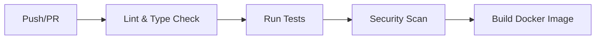

# Recruitment Platform Development Guide

## Table of Contents

1. [Development Setup](#development-setup)
2. [Project Structure](#project-structure)
3. [Adding New Agents](#adding-new-agents)
4. [Adding API Endpoints](#adding-api-endpoints)
5. [Testing](#testing)
6. [Code Style](#code-style)
7. [CI/CD](#cicd)
8. [Debugging](#debugging)

---

## Development Setup

### Prerequisites

- Python 3.12+
- Docker & Docker Compose
- Git

### Initial Setup

```bash
# Clone the repository
git clone <repository-url>
cd recruitment-platform

# Create virtual environment
python -m venv .venv
source .venv/bin/activate

# Install development dependencies
pip install -e ".[dev]"

# Install pre-commit hooks
pre-commit install

# Copy environment configuration
cp .env.example .env
```

### Running the Application

```bash
# Run with auto-reload (development)
python -m recruitment_platform.main

# Or using uvicorn directly
uvicorn recruitment_platform.main:app --reload --host 0.0.0.0 --port 8000
```

### Running Tests

```bash
# Run all tests
pytest

# Run with coverage
pytest --cov=recruitment_platform --cov-report=html

# Run specific test file
pytest src/recruitment_platform/tests/test_agents.py

# Run with verbose output
pytest -v
```

---

## Project Structure

```
recruitment-platform/
├── src/recruitment_platform/
│   ├── agents/               # 50 AI agents across 10 domains
│   │   ├── base.py           # BaseAgent abstract class
│   │   ├── resume_parser/     # 5 agents
│   │   ├── candidate_matcher/ # 5 agents
│   │   ├── interview_scheduler/# 5 agents
│   │   ├── skills_assessor/   # 5 agents
│   │   ├── bias_detector/     # 5 agents
│   │   ├── talent_pool_manager/# 5 agents
│   │   ├── recruitment_analytics/# 5 agents
│   │   ├── onboarding_automator/# 5 agents
│   │   ├── job_description_optimizer/# 5 agents
│   │   └── employer_branding/ # 5 agents
│   ├── api/                  # REST API
│   │   ├── routes/           # Endpoint handlers
│   │   ├── router.py         # API router aggregation
│   │   └── dependencies.py   # Shared dependencies
│   ├── config/               # Configuration
│   │   ├── settings.py       # Pydantic settings
│   │   ├── logging_config.py # Structlog configuration
│   │   └── exceptions.py     # Custom exceptions
│   ├── integrations/         # External service clients
│   │   ├── base.py           # BaseIntegration class
│   │   ├── llm_client.py     # LLM API client
│   │   ├── embedding_client.py
│   │   ├── vector_store.py
│   │   ├── file_parsers.py
│   │   ├── storage.py
│   │   ├── calendar.py
│   │   ├── openai_client.py
│   │   ├── ats_client.py
│   │   ├── hrms_client.py
│   │   ├── glassdoor.py
│   │   ├── indeed.py
│   │   ├── linkedin.py
│   │   └── skill_database.py
│   ├── models/               # Pydantic schemas
│   │   ├── schemas.py        # Request/response models
│   │   └── exceptions.py     # Error models
│   ├── services/             # Business logic
│   │   ├── agent_registry.py
│   │   └── parsing_service.py
│   ├── tests/                # Test suite
│   └── main.py               # Application entry point
├── k8s/                      # Kubernetes manifests
├── .github/workflows/        # CI/CD pipelines
├── docs/                     # Documentation
├── diagrams/                 # Architecture diagrams
├── monitoring/               # Monitoring configuration
├── frontend/                 # Next.js frontend
├── Dockerfile
├── docker-compose.yml
└── pyproject.toml
```

---

## Adding New Agents

### Step 1: Create the Agent Module

Create a new file in the appropriate agent directory:

```python
# src/recruitment_platform/agents/my_domain/my_agent.py
from __future__ import annotations
from typing import Any
from recruitment_platform.agents.base import BaseAgent

class MyAgent(BaseAgent[dict[str, Any], dict[str, Any]]):
    """Description of what this agent does."""

    def __init__(self) -> None:
        super().__init__(name="my_agent")

    async def process(self, input_data: dict[str, Any]) -> dict[str, Any]:
        """Process the input data.

        Args:
            input_data: Dictionary containing input data.

        Returns:
            Processed result.
        """
        # Implement your agent logic here
        return {"result": "success"}
```

### Step 2: Register the Agent

Add the agent to the registry in `src/recruitment_platform/services/agent_registry.py`:

```python
# Add import
from recruitment_platform.agents.my_domain.my_agent import MyAgent

# Add to the agents list in register_default_agents()
agents = [
    # ... existing agents ...
    ("my_agent", MyAgent),
]
```

### Step 3: Add API Endpoint

Create a route handler in `src/recruitment_platform/api/routes/my_domain.py`:

```python
from __future__ import annotations
from typing import Any
from fastapi import APIRouter

router = APIRouter()

@router.post("/my-endpoint")
async def my_endpoint(data: dict[str, Any]) -> dict[str, Any]:
    """Endpoint description."""
    from recruitment_platform.agents.my_domain.my_agent import MyAgent
    agent = MyAgent()
    result = await agent.process(data)
    return {"success": True, "data": result}
```

### Step 4: Add the Router

Include the router in `src/recruitment_platform/api/router.py`:

```python
from recruitment_platform.api.routes import my_domain

api_router.include_router(my_domain.router, prefix="/my-domain", tags=["my-domain"])
```

### Step 5: Write Tests

```python
# src/recruitment_platform/tests/test_my_agent.py
import pytest
from recruitment_platform.agents.my_domain.my_agent import MyAgent

@pytest.mark.asyncio
async def test_my_agent():
    agent = MyAgent()
    result = await agent.process({"input": "test"})
    assert "result" in result
```

---

## Adding API Endpoints

### Endpoint Best Practices

1. **Use Pydantic models** for request/response validation when possible
2. **Wrap agent calls** in try/except and raise HTTPException on failure
3. **Return consistent response format**: `{"success": True, "data": result}`
4. **Document with docstrings** for automatic OpenAPI generation

### Example Endpoint

```python
@router.post("/analyze")
async def analyze(data: AnalyzeRequest) -> dict[str, Any]:
    """Analyze data and return results.

    Args:
        data: Analysis request data.

    Returns:
        Analysis results.

    Raises:
        HTTPException: If analysis fails.
    """
    try:
        agent = MyAgent()
        result = await agent.process(data.model_dump())
        return {"success": True, "data": result}
    except Exception as e:
        raise HTTPException(status_code=500, detail=str(e)) from e
```

---

## Testing

### Test Structure

Tests are located in `src/recruitment_platform/tests/`:

| File | Purpose |
|------|---------|
| `conftest.py` | Shared fixtures |
| `test_api.py` | API endpoint tests |
| `test_agents.py` | Agent unit tests |
| `test_config.py` | Configuration tests |
| `test_integrations.py` | Integration tests |
| `test_models.py` | Schema/model tests |
| `test_services.py` | Service layer tests |

### Running Tests

```bash
# All tests
pytest

# With coverage report
pytest --cov=recruitment_platform --cov-report=html
# Open htmlcov/index.html for detailed report

# Specific test
pytest src/recruitment_platform/tests/test_agents.py::TestResumeParserAgents

# With debugging
pytest --pdb

# Async tests (automatically handled by pytest-asyncio)
pytest -v
```

### Writing Tests

```python
import pytest
from httpx import ASGITransport, AsyncClient
from recruitment_platform.main import create_app

@pytest.fixture
async def client():
    app = create_app()
    async with AsyncClient(transport=ASGITransport(app=app), base_url="http://test") as ac:
        yield ac

@pytest.mark.asyncio
async def test_my_endpoint(client):
    response = await client.post("/api/v1/my-endpoint", json={"key": "value"})
    assert response.status_code == 200
    data = response.json()
    assert data["success"] is True
```

---

## Code Style

### Linting and Formatting

The project uses **Ruff** for linting and formatting:

```bash
# Check code style
ruff check src/

# Auto-fix issues
ruff check --fix src/

# Format code
ruff format src/
```

### Type Checking

The project uses **mypy** in strict mode:

```bash
# Run type checker
mypy src/
```

### Pre-commit Hooks

Pre-commit hooks run automatically on `git commit`:

```bash
# Run manually
pre-commit run --all-files

# Skip hooks (not recommended)
git commit --no-verify
```

### Code Conventions

- **Line length**: 100 characters
- **Import sorting**: isort via Ruff
- **Type hints**: Required for all functions (strict mypy)
- **Docstrings**: Google style for all public classes and methods
- **Async/await**: All I/O operations must be async

---

## CI/CD

### GitHub Actions Workflows

| Workflow | Trigger | Purpose |
|----------|---------|---------|
| `ci.yml` | Push to main/develop, PR to main | Lint, test, security scan, build |
| `cd.yml` | Tag push (v*.*.*) | Build, push, deploy to staging/production |
| `codeql.yml` | Push to main, PR to main, weekly | CodeQL security analysis |

### CI Pipeline Stages



### Running CI Locally

```bash
# Run linting
ruff check src/
ruff format --check src/
mypy src/

# Run tests
pytest --cov=recruitment_platform

# Run security scan
bandit -r src/
safety check
```

---

## Debugging

### Using the Debugger

```python
# Add breakpoint in your code
import pdb; pdb.set_trace()

# Or use breakpoint() (Python 3.7+)
breakpoint()
```

### VS Code Configuration

Create `.vscode/launch.json`:

```json
{
    "version": "0.2.0",
    "configurations": [
        {
            "name": "Python: Recruitment Platform",
            "type": "python",
            "request": "launch",
            "module": "recruitment_platform.main",
            "justMyDebug": true,
            "envFile": "${workspaceFolder}/.env"
        }
    ]
}
```

### Logging

The application uses structured logging with structlog:

```python
import logging

logger = logging.getLogger(__name__)

async def my_function():
    logger.info("Processing started", extra={"key": "value"})
    # ...
    logger.error("Processing failed", exc_info=True)
```

### Common Issues

#### Import Errors

```bash
# Ensure the package is installed in editable mode
pip install -e .
```

#### Database Connection Issues

```bash
# Check database URL
echo $DATABASE_URL

# Test connection
python -c "from sqlalchemy import create_engine; engine = create_engine('your-url'); engine.connect()"
```

#### Test Failures

```bash
# Run with verbose output
pytest -v --tb=long

# Run single test with debugging
pytest --pdb src/recruitment_platform/tests/test_agents.py::test_name
```
