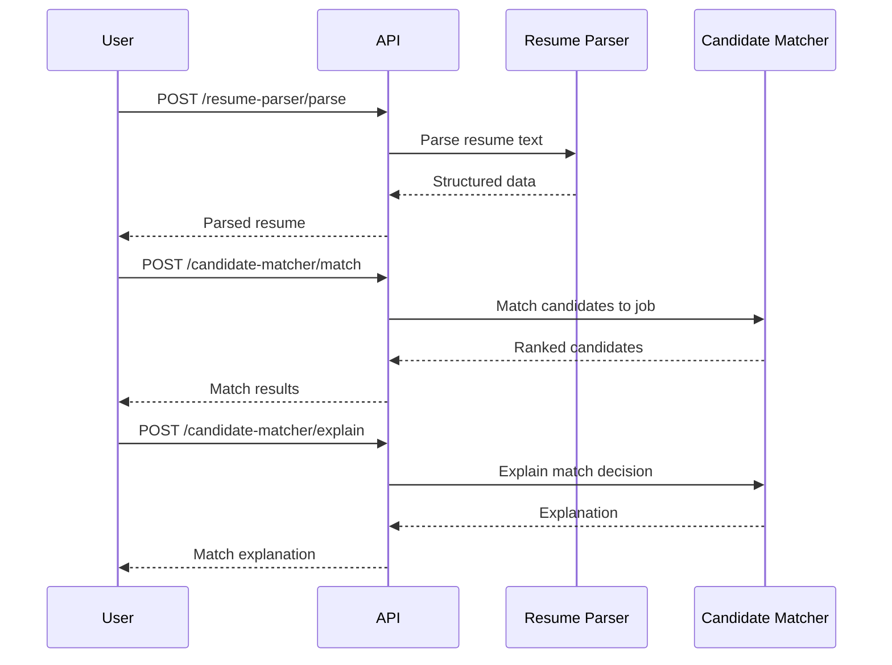
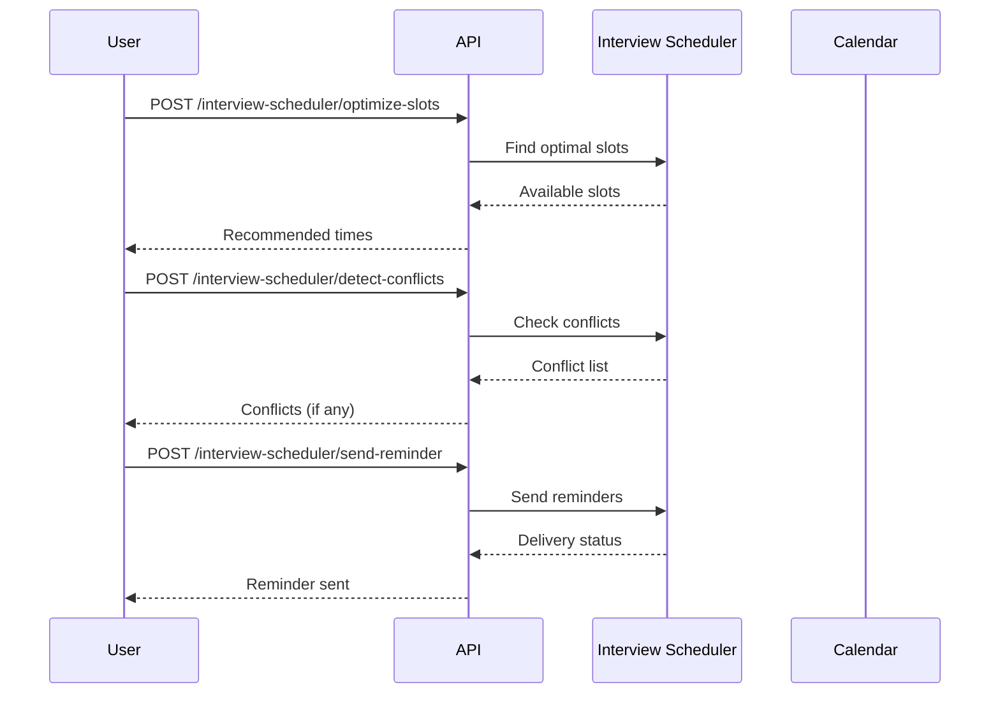
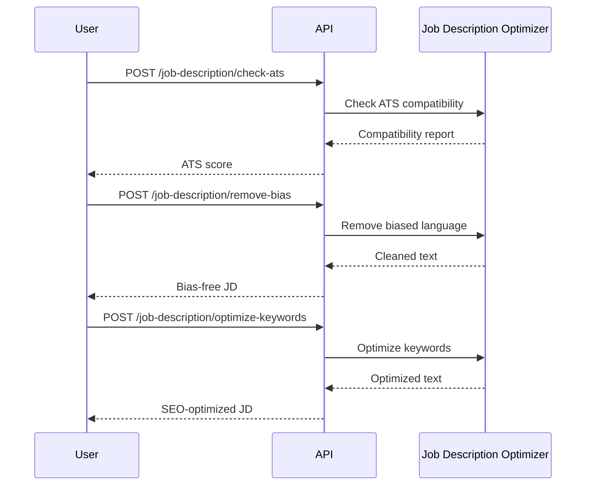
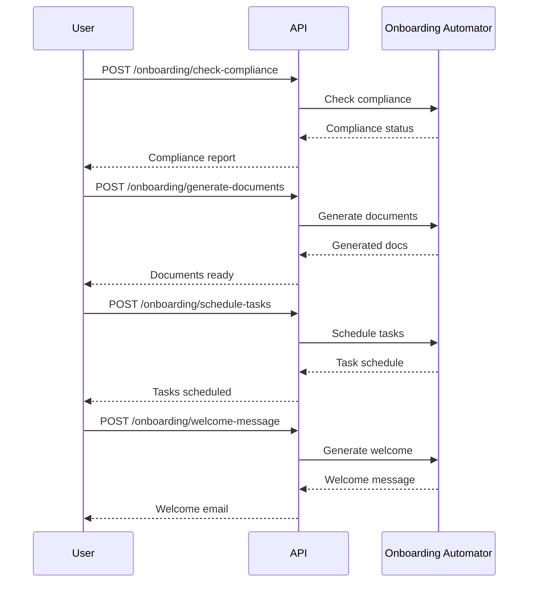

# Recruitment Platform User Guide

## Table of Contents

1. [Introduction](#introduction)
2. [Getting Started](#getting-started)
3. [Using the API](#using-the-api)
4. [Recruitment Workflows](#recruitment-workflows)
5. [Best Practices](#best-practices)
6. [Troubleshooting](#troubleshooting)

---

## Introduction

The Recruitment Platform is a unified AI-powered recruitment automation system. It provides 50 AI agents across 10 recruitment domains, all accessible through a single REST API. This guide will help you understand how to use the platform effectively.

### Key Features

- **Resume Parsing**: Automatically extract contact info, education, experience, and skills from resumes
- **Candidate Matching**: Bias-aware ranking and semantic matching of candidates to jobs
- **Interview Scheduling**: Automated slot optimization, conflict detection, and reminders
- **Skills Assessment**: Proficiency scoring, gap analysis, and learning path recommendations
- **Bias Detection**: Language bias detection, fairness scoring, and mitigation recommendations
- **Talent Pool Management**: Candidate sourcing, engagement tracking, and pool health analysis
- **Recruitment Analytics**: Cost analysis, funnel metrics, diversity tracking, and predictions
- **Onboarding Automation**: Compliance checking, document generation, and progress tracking
- **Job Description Optimization**: ATS compatibility, bias removal, keyword and SEO optimization
- **Employer Branding**: Brand strategy, content generation, reputation management, and sentiment analysis

---

## Getting Started

### Prerequisites

- Python 3.12+
- Docker & Docker Compose (optional)
- Kubernetes cluster (for production)

### Quick Start

#### Using Docker Compose (Recommended)

```bash
# Clone the repository
git clone <repository-url>
cd recruitment-platform

# Copy environment configuration
cp .env.example .env

# Start all services
docker-compose up --build

# Access the application
# API: http://localhost:8000
# Interactive Docs: http://localhost:8000/docs
# ReDoc: http://localhost:8000/redoc
```

#### Local Development

```bash
# Create virtual environment
python -m venv .venv
source .venv/bin/activate

# Install dependencies
pip install -e ".[dev]"

# Run the application
python -m recruitment_platform.main
```

### Verifying the Installation

```bash
# Check health
curl http://localhost:8000/api/v1/health
# Expected: {"status": "healthy", "service": "recruitment-platform"}

# Check readiness
curl http://localhost:8000/api/v1/ready
# Expected: {"status": "ready"}
```

---

## Using the API

### Interactive Documentation

Once the application is running, access the interactive API documentation:

- **Swagger UI**: http://localhost:8000/docs
- **ReDoc**: http://localhost:8000/redoc

These interfaces allow you to explore all endpoints, view request/response schemas, and make test requests directly from the browser.

### Authentication

Include your secret key in the `Authorization` header:

```
Authorization: Bearer <SECRET_KEY>
```

### Common Patterns

#### Standard Response Envelope

All endpoints return responses in a consistent format:

```json
{
  "success": true,
  "data": { ... },
  "error": null,
  "metadata": { ... }
}
```

#### Error Handling

When an error occurs, the response includes details:

```json
{
  "success": false,
  "error": "Error message",
  "details": [
    {
      "field": "text",
      "message": "Field is required",
      "code": "required"
    }
  ]
}
```

---

## Recruitment Workflows

### Workflow 1: Parse and Match Candidates

This workflow covers the complete process from resume parsing to candidate matching.



**Step 1: Parse a Resume**

```bash
curl -X POST http://localhost:8000/api/v1/resume-parser/parse \
  -H "Content-Type: application/json" \
  -d '{
    "text": "John Doe\njohn.doe@email.com\n(555) 123-4567\n\nEducation:\nBachelor of Science in Computer Science\nStanford University, 2018\n\nExperience:\nSenior Software Engineer at Google\nJan 2020 - Present\n\nSkills: Python, Java, AWS, Kubernetes"
  }'
```

**Step 2: Match Candidates to a Job**

```bash
curl -X POST http://localhost:8000/api/v1/candidate-matcher/match \
  -H "Content-Type: application/json" \
  -d '{
    "candidates": [
      {
        "id": "cand-001",
        "name": "John Doe",
        "skills": ["Python", "Java", "AWS", "Kubernetes"],
        "experience_years": 5,
        "match_score": 0.92
      }
    ],
    "job_requirements": {
      "title": "Senior Software Engineer",
      "required_skills": ["Python", "AWS", "Kubernetes"],
      "min_experience_years": 3
    }
  }'
```

**Step 3: Analyze Skills Gap**

```bash
curl -X POST http://localhost:8000/api/v1/candidate-matcher/gap-analysis \
  -H "Content-Type: application/json" \
  -d '{
    "candidate_skills": ["Python", "AWS"],
    "required_skills": ["Python", "AWS", "Kubernetes"]
  }'
```

### Workflow 2: Schedule Interviews



**Step 1: Optimize Interview Slots**

```bash
curl -X POST http://localhost:8000/api/v1/interview-scheduler/optimize-slots \
  -H "Content-Type: application/json" \
  -d '{
    "participants": [
      {
        "id": "interviewer-1",
        "name": "Alice",
        "availability": [
          {"start": "2024-01-15T09:00:00Z", "end": "2024-01-15T17:00:00Z"}
        ]
      },
      {
        "id": "candidate-1",
        "name": "Bob",
        "availability": [
          {"start": "2024-01-15T10:00:00Z", "end": "2024-01-15T15:00:00Z"}
        ]
      }
    ],
    "duration_minutes": 60,
    "preferred_days": ["Monday", "Tuesday", "Wednesday"]
  }'
```

**Step 2: Detect Conflicts**

```bash
curl -X POST http://localhost:8000/api/v1/interview-scheduler/detect-conflicts \
  -H "Content-Type: application/json" \
  -d '{
    "proposed_slot": {
      "start": "2024-01-15T14:00:00Z",
      "end": "2024-01-15T15:00:00Z"
    },
    "existing_events": [
      {
        "title": "Team Standup",
        "start": "2024-01-15T14:30:00Z",
        "end": "2024-01-15T15:00:00Z"
      }
    ]
  }'
```

**Step 3: Send Reminders**

```bash
curl -X POST http://localhost:8000/api/v1/interview-scheduler/send-reminder \
  -H "Content-Type: application/json" \
  -d '{
    "interview": {
      "id": "int-001",
      "candidate": "Bob",
      "time": "2024-01-15T14:00:00Z"
    },
    "reminder_type": "email"
  }'
```

### Workflow 3: Optimize Job Descriptions



**Step 1: Check ATS Compatibility**

```bash
curl -X POST http://localhost:8000/api/v1/job-description/check-ats \
  -H "Content-Type: application/json" \
  -d '{
    "job_description": "We are looking for a Senior Software Engineer with 5+ years of experience in Python and AWS."
  }'
```

**Step 2: Remove Bias**

```bash
curl -X POST http://localhost:8000/api/v1/job-description/remove-bias \
  -H "Content-Type: application/json" \
  -d '{
    "job_description": "We need a young, energetic salesman who can work long hours"
  }'
```

**Step 3: Optimize Keywords**

```bash
curl -X POST http://localhost:8000/api/v1/job-description/optimize-keywords \
  -H "Content-Type: application/json" \
  -d '{
    "job_description": "Looking for a software engineer to build web applications",
    "target_role": "Senior Software Engineer"
  }'
```

### Workflow 4: Onboard New Hires



**Step 1: Check Compliance**

```bash
curl -X POST http://localhost:8000/api/v1/onboarding/check-compliance \
  -H "Content-Type: application/json" \
  -d '{
    "employee_data": {
      "name": "Jane Smith",
      "start_date": "2024-02-01",
      "role": "Software Engineer"
    },
    "jurisdiction": "US"
  }'
```

**Step 2: Generate Documents**

```bash
curl -X POST http://localhost:8000/api/v1/onboarding/generate-documents \
  -H "Content-Type: application/json" \
  -d '{
    "employee": {
      "name": "Jane Smith",
      "role": "Software Engineer",
      "department": "Engineering"
    },
    "template_config": {
      "include_offer_letter": true,
      "include_policy_ack": true
    }
  }'
```

**Step 3: Schedule Tasks**

```bash
curl -X POST http://localhost:8000/api/v1/onboarding/schedule-tasks \
  -H "Content-Type: application/json" \
  -d '{
    "employee": {"name": "Jane Smith", "role": "Software Engineer"},
    "start_date": "2024-02-01"
  }'
```

**Step 4: Generate Welcome Message**

```bash
curl -X POST http://localhost:8000/api/v1/onboarding/welcome-message \
  -H "Content-Type: application/json" \
  -d '{
    "employee": {"name": "Jane Smith", "role": "Software Engineer"},
    "team_info": {"name": "Platform Team", "manager": "John Doe"}
  }'
```

### Workflow 5: Analyze Recruitment Metrics

```bash
# Cost analysis
curl -X POST http://localhost:8000/api/v1/analytics/cost-analysis \
  -H "Content-Type: application/json" \
  -d '{
    "hiring_data": {"total_hires": 50, "total_applications": 1000},
    "cost_data": {"total_spend": 500000, "channel_costs": {"linkedin": 200000}}
  }'

# Funnel analysis
curl -X POST http://localhost:8000/api/v1/analytics/funnel-analysis \
  -H "Content-Type: application/json" \
  -d '{
    "funnel_data": {
      "stages": ["applied", "screened", "interviewed", "offered", "hired"],
      "counts": [1000, 500, 200, 50, 30]
    }
  }'

# Diversity metrics
curl -X POST http://localhost:8000/api/v1/analytics/diversity-metrics \
  -H "Content-Type: application/json" \
  -d '{
    "pipeline_data": {"stages": ["applied", "hired"], "counts": [1000, 50]},
    "demographics": {"gender": {"M": 600, "F": 400}}
  }'
```

---

## Best Practices

### Resume Parsing

1. **Provide clean text**: Ensure resume text is well-formatted with clear section headers
2. **Use the full parse endpoint**: Use `/resume-parser/parse` for complete extraction rather than individual extractors
3. **Validate results**: Always review extracted data for accuracy before making decisions

### Candidate Matching

1. **Include match scores**: Provide pre-computed match scores when available for better ranking
2. **Use gap analysis**: Follow up with `/candidate-matcher/gap-analysis` to understand skill deficiencies
3. **Explain decisions**: Use `/candidate-matcher/explain` to provide transparency to candidates

### Bias Detection

1. **Analyze job descriptions first**: Use `/bias-detector/analyze-language` before posting job descriptions
2. **Monitor fairness**: Regularly use `/bias-detector/fairness-score` to track hiring fairness
3. **Act on recommendations**: Use `/bias-detector/recommendations` to get actionable mitigation steps

### Interview Scheduling

1. **Optimize before scheduling**: Always use `/interview-scheduler/optimize-slots` first
2. **Check conflicts**: Use `/interview-scheduler/detect-conflicts` before confirming
3. **Send reminders**: Use `/interview-scheduler/send-reminder` to reduce no-shows

### Job Description Optimization

1. **Check ATS first**: Use `/job-description/check-ats` to ensure compatibility
2. **Remove bias**: Use `/job-description/remove-bias` to create inclusive descriptions
3. **Optimize for search**: Use both `/job-description/optimize-keywords` and `/job-description/optimize-seo`

---

## Troubleshooting

### Common Issues

#### Connection Refused

```
ConnectionRefusedError: [Errno 61] Connection refused
```

**Solution**: Ensure the application is running:
```bash
# Check if the container is running
docker-compose ps

# Start the application
docker-compose up
```

#### 500 Internal Server Error

**Solution**: Check the application logs:
```bash
docker-compose logs api
```

#### Rate Limit Exceeded

**Solution**: Reduce request frequency or increase the rate limit in the NGINX ingress configuration.

#### Invalid Input Data

**Solution**: Verify your request body matches the expected schema. Use the interactive docs at `/docs` for reference.

### Getting Help

- **API Documentation**: http://localhost:8000/docs
- **ReDoc**: http://localhost:8000/redoc
- **Health Check**: http://localhost:8000/api/v1/health
- **GitHub Issues**: https://github.com/your-org/recruitment-platform/issues
